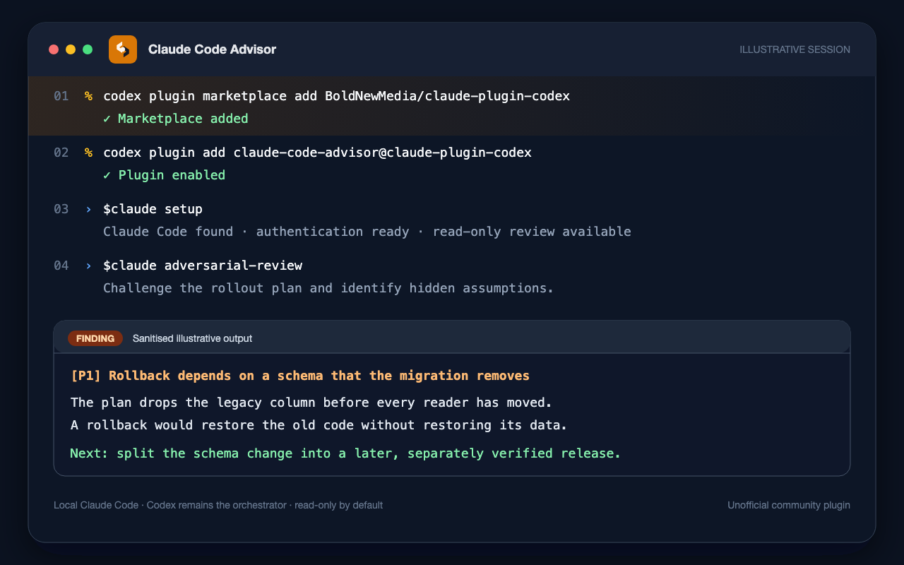

# Claude Code Advisor for Codex

[](https://github.com/BoldNewMedia/claude-plugin-codex/actions/workflows/ci.yml)
[](https://github.com/BoldNewMedia/claude-plugin-codex/releases)
[](LICENSE)

Catch hidden assumptions in Codex changes with a read-only Claude Code review,
without leaving Codex. Codex stays in charge of the task; your existing local
Claude Code installation supplies the second opinion.



This is an unofficial, community-maintained integration. It is not endorsed by
or affiliated with OpenAI or Anthropic.

Maintained by [Bold New Media](https://github.com/BoldNewMedia). From v0.1.13,
releases come from this maintained fork of the original
[`yanchuk/claude-plugin-codex`](https://github.com/yanchuk/claude-plugin-codex)
project. The project retains its MIT licence and original attribution.

## Install

Add the public marketplace and install the plugin:

```bash
codex plugin marketplace add BoldNewMedia/claude-plugin-codex
codex plugin add claude-code-advisor@claude-plugin-codex
```

Alternatively, after adding the marketplace, open Codex's plugin directory,
find **Claude Code Advisor for Codex**, and install **Claude Code Advisor**.

Start a new Codex thread and verify the install:

```text
$claude setup
```

If Codex was already running, start a new thread or restart Codex before using
`$claude`.

To update the marketplace snapshot and reinstall the current plugin version:

```bash
codex plugin marketplace upgrade claude-plugin-codex
codex plugin remove claude-code-advisor@claude-plugin-codex
codex plugin add claude-code-advisor@claude-plugin-codex
```

To remove the plugin and its marketplace source:

```bash
codex plugin remove claude-code-advisor@claude-plugin-codex
codex plugin marketplace remove claude-plugin-codex
```

## What It Is

If you already use Codex and Claude Code, this plugin brings Claude Code into
your Codex workflow. Codex stays in charge of the thread. Claude Code gives a
second pass through the local `claude` CLI.

Use it for four things:

- a normal read-only Claude review
- a more skeptical adversarial review
- a quick second opinion while Codex keeps working
- a rescue pass when a Codex thread stalls or needs another agent

This is the inverse of
[`openai/codex-plugin-cc`](https://github.com/openai/codex-plugin-cc). That
plugin pulls Codex into Claude Code. This one pulls local Claude Code into
Codex.

## Status and compatibility

Alpha. Use it on real work only with normal review and source-control controls.
The stable command form is `$claude`. If your Codex UI exposes the skill as
`/claude`, you can use that as an alias.

| Component | Verified status |
|---|---|
| Codex CLI | Marketplace and end-to-end routing verified with `0.130.0` |
| Claude Code CLI | Capability detection verified with `2.1.201`; an authenticated local account is required |
| Node.js | Automated tests run on 20, 22 and 24; runtime minimum is 18.18 |
| macOS | Live local workflow verified |
| Linux | Deterministic tests and metadata validation run in GitHub Actions |
| Windows | Not yet independently verified; tester reports are welcome |

Before beta, the project needs repeatable external installation results on
macOS, Linux and Windows. Supervised background mode is currently proved only
on macOS; other platforms fail closed to foreground operation.

See the [alpha testing guide](docs/alpha-testing.md) to join the initial
compatibility cohort. Windows and Linux reports are particularly useful.

## Core Commands

- `$claude setup` checks whether Claude Code is installed, authenticated, and
  supports the needed CLI features.
- `$claude review` runs the short structured read-only review route for local
  git state.
- `$claude adversarial-review` asks Claude to challenge a plan or diff.
- `$claude advise` asks Claude for a quick second opinion.
- `$claude do` gives Claude a prepared coding, exploration, verifier, scout, or
  synthesis task.
- `$claude rescue` hands Claude a debugging or implementation task. It is
  read-only unless you pass `--write`.
- `$claude monitor` polls a background Claude job and reports its explicit
  lifecycle and result state.
- `$claude status`, `$claude result`, and `$claude cancel` manage Claude jobs.

See the [command reference](docs/commands.md) for complete syntax, examples and
safety flags.

Longer jobs can run in the background:

```text
$claude advise --background should this VAD tuning loop collect N=5 now?
$claude do --background --model sonnet map the auth module and return file:line citations
$claude rescue --background --model opus investigate the flaky integration test
$claude monitor <job-id>
$claude result <job-id>
```

Slash-style aliases are best-effort. Codex plugin manifests do not yet expose a
documented custom slash-command API, so `$claude` is the portable form. If your
Codex build passes slash-style text to skills, these forms map to the same
commands:

```text
/claude setup
/claude:advise should this plan use a background worker?
/claude:do --background --model sonnet map the auth module
/claude:rescue --background investigate the flaky integration test
/claude:review --base main
/claude:adversarial-review challenge the state management assumptions
```

## When To Use It

A good default pattern is simple:

- Run `$claude review` for a normal second pass.
- Run `$claude adversarial-review` when the change is high stakes.
- Run `$claude advise --background` when you want another model to check a
  plan, tradeoff, or evidence bundle.
- Run `$claude do --background` when the user wants Claude to perform a
  specific prepared task.
- Run `$claude rescue --background` when Codex stalls or you want Claude to
  take a deeper pass.

Adversarial review is especially useful for migrations, auth changes, infra
scripts, refactors, and work where the danger is hidden assumptions rather than
syntax errors.

## Requirements

- Codex with plugin marketplace support.
- Claude Code installed and authenticated on the same machine.
- Node.js 18.18 or newer.

## Local Development

From a local checkout:

```bash
codex plugin marketplace add ./
```

After installation, new Codex sessions should load the skill as
`claude-code-advisor:claude`. Codex writes an enabled plugin entry similar to:

```toml
[plugins."claude-code-advisor@claude-plugin-codex"]
enabled = true
```

## Usage

Use `$claude` in a Codex thread:

```text
$claude setup
$claude advise --background should this plan use a background worker?
$claude do --background --model sonnet map this package and cite file:line call sites
$claude do --background --model opus debug this cross-module failure with a prepared task
$claude rescue --background --model opus investigate the flaky integration test
$claude monitor <job-id>
$claude rescue --write fix the failing test with the smallest safe patch
$claude review --base main
$claude adversarial-review challenge the state management assumptions
$claude status
$claude result <job-id>
$claude cancel <job-id>
```

If your Codex build shows `/claude` in the slash menu, it is an alias for the
same skill.

## Monitoring

Use background mode when Claude may need more than one short answer:

```text
$claude rescue --background --model opus investigate the flaky integration test
$claude monitor <job-id>
```

MCP is off by default. If the workspace or an ancestor directory has
`.mcp.json`, the companion refuses background mode because Claude Code can
still open an interactive MCP permission picker before returning an answer.
Use foreground mode, or pass `--allow-mcp` only after the user explicitly asks
Claude to use MCP.

The monitor reads only plugin-managed state. A checked-in supervisor owns a
checked-in process-group anchor, which directly starts the `claude -p
--output-format json` child. The anchor streams bounded stdout and stderr and
keeps the group identity live through termination and escalation. The
supervisor commits one terminal state under the state lock. It never uses
`claude logs`, terminal text or stderr as a result source.

For new background jobs, `result` is available only after successful process
exit and strict validation of exactly one UTF-8 provider JSON document. The
envelope must report a successful result, a string payload and a canonical
session UUID. Trailing text, multiple documents, duplicate critical keys,
oversized output and resume identity changes fail closed. Repeated `monitor`,
`result` and late `cancel` calls cannot replace a committed result.

Foreground `advise` and `rescue` calls have a two-minute timeout. If one times
out, the companion records the timed-out attempt and starts one background job
for the same prompt. Use `--background` up front for real advisor work; use
`--no-background-fallback` only when you want a timeout to fail fast.

## Safety

Review and adversarial review are read-only. `advise` and `rescue` are also
read-only unless you pass `--write`. Write-capable Claude work is recorded as a
separate job type.

`$claude do --model sonnet` is for prepared junior-agent work. Before using it,
Codex should apply `tasks-for-sonnet` and turn the request into a bounded task:
role, absolute paths, word cap, What Must Be True, Known Constraints, Mechanical
Verification, and Stop Conditions. Use it for scouts, mappers, verifiers,
single-concern reviewers, synthesis, or fully specified scaffolding. Do not use
Sonnet for broad application code that needs judgment.

`$claude do --model opus` is the backup for complex Claude tasks: ambiguous
debugging, broad refactors, architecture changes, auth, money, migrations, PII,
provider reliability, AI runtime paths, or work that needs the same level of
judgment you would reserve for GPT-5.5. Still prepare a specific task with
paths, constraints, allowed write scope, verification, and stop conditions.

Foreground `$claude advise`, `$claude do --model opus`, and
`$claude rescue --model opus` use a larger default turn budget for prepared
work. Pass `--max-turns <n>` to override it. `$claude review` and
`$claude adversarial-review` stay tight and structured with a single default
turn.

Managed Claude jobs ignore inherited MCP server config by default. This keeps
advisor and rescue runs from blocking on an interactive "enable MCP servers?"
prompt inside Codex.

The companion enforces this with strict non-interactive flags:

```bash
--mcp-config '{"mcpServers":{}}' --strict-mcp-config --no-chrome
```

Background mode has an extra guard: if the current directory or any ancestor
contains `.mcp.json`, background launch is blocked unless you pass
`--allow-mcp`. Do that only after the user explicitly asks Claude to use MCP.

Read-only `advise`, `do` and `rescue` tasks use `Read,Glob,Grep` by default.
Web tools are denied unless `--allow-web` is explicit. Pass that flag only when
the task needs external URLs or documentation.

The plugin does not force Sonnet for advisor, review, adversarial-review, or
rescue work. It lets Claude Code use your configured default model unless you
explicitly pass another model. It uses xhigh effort by default for Claude
advisor work. Sonnet belongs in junior-agent delegation workflows, not in the
default advisor path.

The companion runtime tracks jobs by workspace and Codex thread ID when Codex
provides one. If it cannot safely infer a thread, it requires an explicit job
ID before resuming work.

Plugin job, supervisor lifecycle and canonical Claude session identities remain
separate. Resume uses only the canonical full session UUID returned by a
validated provider JSON envelope, and the resumed envelope must return the same
UUID. Legacy ambiguous and in-flight jobs are not reconciled from logs or
resumed. Foreground and background `rescue --resume` never silently start a new
conversation. A read-only command cannot resume a write-capable session.

Claude Code must already be installed and authenticated on the host:

```bash
claude auth login
```

## Privacy

This plugin does not run a hosted service. It runs the local Claude Code CLI on
your machine. Your local Claude Code installation and Anthropic account handle
prompts, file context, and command output sent to Claude Code.

The plugin stores job metadata and results under your local Codex home directory
so `$claude status`, `$claude result`, and `$claude cancel` can work across
turns. It does not intentionally collect analytics, phone home, or send data to
the repository owner.

See the full [privacy policy](PRIVACY.md) for data categories, recipients,
retention and user controls.

## State Storage

By default the companion stores state under:

```text
~/.codex/claude-plugin-codex
```

Set `CLAUDE_COMPANION_STATE_ROOT` to use another local directory:

```bash
CLAUDE_COMPANION_STATE_ROOT=/path/to/writable/state \
  node plugins/claude-code-advisor/scripts/claude-companion.mjs setup --json
```

This is useful in sandboxed Codex environments where the default Codex home
path is readable but not writable. The state root should be local, private, and
excluded from version control because it can contain validated Claude results
and bounded job metadata. New supervised records do not persist prompts, raw
stdout, raw stderr, terminal logs, credentials or environment values.

State mutations are serialised across companion processes and committed with
an atomic same-directory replacement. State and pointer files use mode `0600`;
their directories use mode `0700`. Malformed JSON and unsupported schema
versions are visible errors. The original evidence is preserved rather than
silently replaced with empty state.

## Terms

This project is provided under the MIT License. You are responsible for how you
use Codex, Claude Code, and any data you send through those tools. See the full
[terms of use](TERMS.md).

## How It Works

The `claude` skill routes each request to:

```bash
node "<plugin root>/scripts/claude-companion.mjs" <subcommand> <args>
```

The companion owns:

- command parsing
- Claude CLI invocation
- capability detection
- job state
- foreground and background lifecycle
- review JSON validation
- safety boundaries for read-only versus write-capable work

## Development

Use Node.js 24 for development. The repository includes `.node-version` for
compatible version managers, and CI also checks Node.js 20 and 22 compatibility.

```bash
npm test
npm run validate
```

Optional smoke test against the installed Claude CLI:

```bash
npm run test:smoke
CLAUDE_PLUGIN_CODEX_RUN_BG_SMOKE=1 npm run test:smoke
```

The authenticated opt-in form uses a disposable Git repository and a separate
temporary state root. It checks the installed CLI help contract, exact and
idempotent nonce results, a canonical full-UUID foreground resume and a
background resume through the supervised print lifecycle. It inherits the
invoking process environment but neither enumerates nor prints it. Its proved
restrictions are disposable repository and state roots, an empty strict MCP
configuration, disabled web tools and Chrome, plan permission mode, and the
local read-only tools `Read,Glob,Grep`. It verifies immutable results and
supervisor cleanup before deleting temporary roots. It does not print prompts,
responses, credentials, session identifiers, provider output or raw stderr.
The live write-capable route is intentionally not exercised.

Optional end-to-end smoke test against an installed Codex plugin:

```bash
npm run test:e2e:codex
```

This requires `codex plugin marketplace add ./` and **Claude Code Advisor**
installed from Codex's plugin directory. It
starts a fresh `codex exec` session and verifies that
`$claude advise --model sonnet` routes through the installed skill. The test
uses Codex's `workspace-write` sandbox,
supplies a private temporary companion state root inside the checkout, and
removes that state before checking the worktree. If the nested Codex sandbox
cannot access Claude's authenticated session, the test reports authentication
unavailability explicitly and verifies routing only. The separate opt-in smoke
above verifies the authenticated Claude contract. Sonnet is used only for this
small routing test.

## Current Limits

- The plugin depends on the installed Claude Code CLI contract. Run
  `$claude setup` after upgrading Claude Code.
- Supervised background mode currently requires macOS. It is unavailable on
  unproved platforms; there is no provider-background or terminal-log fallback.
- A live supervisor is the only process allowed to signal the Claude process
  group it created. After supervisor loss, stored PIDs are not signalling
  authority: the job becomes `interrupted` and manual orphan recovery may be
  required. Abrupt supervisor `SIGKILL` and host power loss cannot guarantee
  descendant cleanup.
- Background mode refuses the current directory and ancestor directories with
  `.mcp.json` unless `--allow-mcp` is explicit. This avoids Claude Code's
  interactive MCP picker inside Codex, including nested worktrees under a repo
  that has MCP config.
- Read-only `advise`, `do` and `rescue` tasks disable web tools by default. Use
  `--allow-web` only when the task needs external access.
- Foreground prepared task routes use a larger default turn budget than
  structured review. If Claude reports that it hit the max-turn limit, rerun
  with `--max-turns <higher>` or narrow the task.
- Working-tree structured reviews stop when untracked files exist because their
  contents are absent from a Git diff and review mode cannot read the workspace.
  Stage the intended files before rerunning the review.
- Working-tree and `--base` reviews also fail closed when Git fails or the full
  diff exceeds 1 MiB. Narrow or split the change and rerun; the companion never
  downgrades an incomplete diff to a stat-only review.
- `$claude monitor` checks plugin-managed state every 30 seconds by default.
  It neither reads provider logs nor interprets terminal progress.
- Structured review extracts a single complete JSON object from Claude's
  `--output-format json` result envelope, tolerating leading status prose or
  tool-call markup while rejecting ambiguous multiple objects. The extracted
  review payload is still validated strictly, and the companion retries once
  before failing.

## Troubleshooting

If Codex shows `Unable to load skill contents` after an update, restart Codex
or start a new thread. Codex may still point at an older cached skill path after
a plugin version bump. If the error remains, remove and reinstall the
`claude-plugin-codex` marketplace.

If `$claude setup` or a companion command fails with a write permission error
under `~/.codex/claude-plugin-codex`, rerun it with `CLAUDE_COMPANION_STATE_ROOT`
pointing at a writable directory. Within that root, the companion restricts its
workspace and thread directories to mode `0700` and state/pointer files to mode
`0600`. Do not point it at the project repository unless you also ignore that
path in Git.

If the companion reports malformed or unsupported state, do not delete the
reported file before inspecting or copying it. The plugin preserves the
evidence and refuses to continue with fabricated empty state. Resolve the
corrupt file explicitly, then rerun the command.

If state locking times out and the diagnostic says the recorded owner is no
longer running, verify that no companion process owns the reported lock before
removing that one lock file. The companion never breaks a lock from age or PID
evidence alone.

If a review reports the 1 MiB diff limit, split the review into smaller complete
changes or narrow the selected base. Do not rely on a partial or stat-only
review.

## License

MIT.
